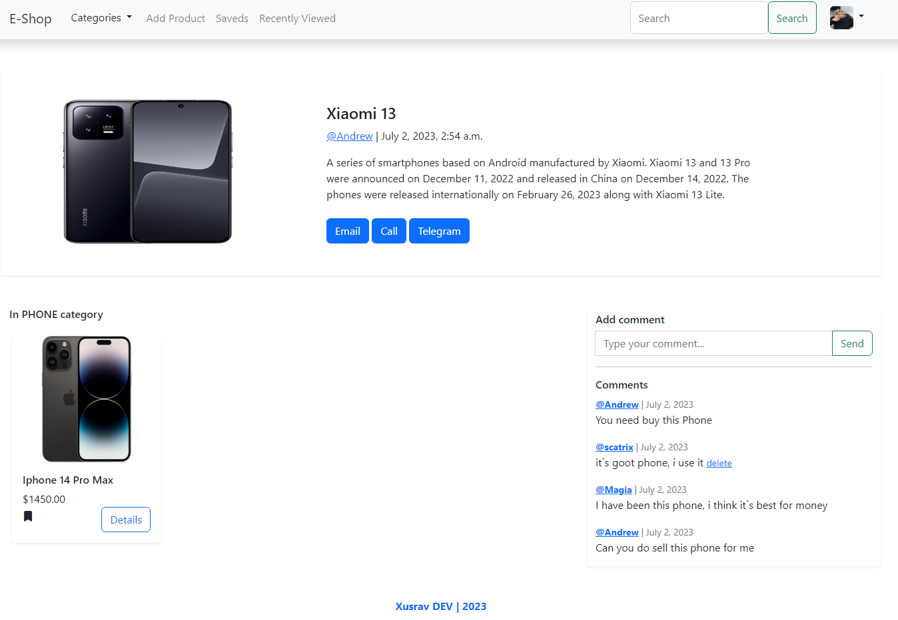
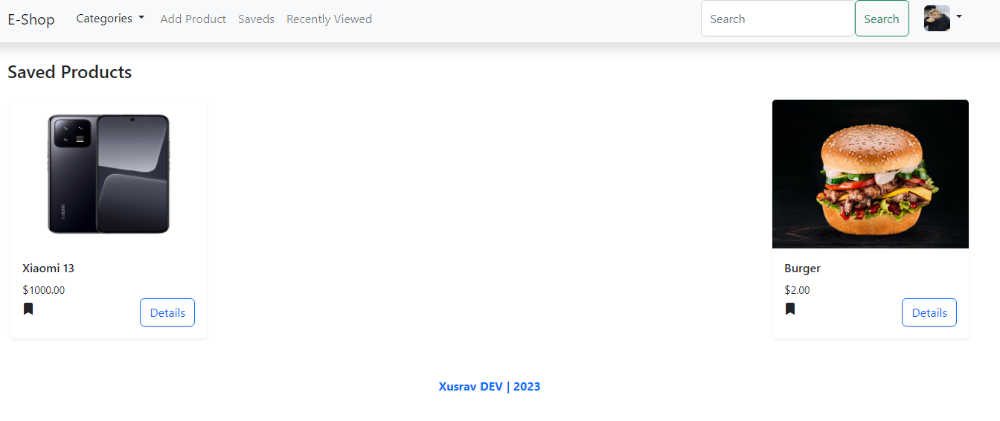

#  Django E-Commerce 

Django Commerce is an e-commerce web application built with Django framework. It allows users to sign up, create profiles, view and search for products, add products to their saved list, view recently viewed products, and interact with product comments.

##  Features 

1. **User Registration**:
   `Users can register for an account to access the full features of the application. Only non-authenticated users can access the registration page.`

2. **User Profile**:
   `Users can view their profile information. Authenticated users can update their profile information.`

3. **Product Management**:
   `Authenticated users can create new products. Users can view product details, including images and comments. Users can search for products using a search query. Authenticated users can update and delete their own products.`

4. **Saved Products**:
   `Authenticated users can save products to their saved list. Users can add or remove products from their saved list.`

5. **Recently Viewed Products**:
   `Users can view recently viewed products. The recently viewed products are stored in the session.`

##  Installation 

* Clone the repository:
  `git clone https://github.com/xusraw1/e-commerce`

* Navigate to the project directory:
  `cd e-commerce`

* Install the required dependencies:
  `pipenv install`

* Apply database migrations:
  `python manage.py migrate`

* Start the development server:
  `python manage.py runserver`

* Open the web browser and visit [E-commerce](http://localhost:8000) to access the application.

##  Configuration 

The Django Commerce project uses the default Django configuration with the following additional settings:

1. **Database Configuration**:
    * The project is configured to use the default SQLite database.
    * You can change the database settings in the settings.py file.

2. **Static Files**:
    * The static files are served from the static directory.
    * You may need to configure your web server or file serving mechanism to serve these static files in a production
      environment.

3. **Media Files**:
    * The media files, including product images, are stored in the media directory.
    * You may need to configure your web server or file serving mechanism to serve these media files in a production
      environment.

##  Usage 

1. Register a new account by visiting the registration page.
2. Log in to your account.
3. Explore the available products on the homepage.
4. Click on a product to view its details, including images and comments.
5. Use the search bar to search for specific products.
6. To create a new product, navigate to the profile page and click on the "New Product" button.
7. To save a product, click on the "Save" button on the product detail page.
8. To view your saved products, navigate to the saved products page.
9. To view your recently viewed products, navigate to the recently viewed products page.
10. To update or delete a product, navigate to the product detail page and click on the "Edit" or "Delete" button (
    available only for the product owner).
11. To add a comment on a product, scroll down to the comments section on the product detail page and submit your
    comment.
12. To delete a comment, click on the "Delete" link next to your comment (available only for the comment owner).

##  Images 

> **Home PAGE**

> **Product PAGE**

> **Profile PAGE**

> **Add-Product PAGE**

> **Recently View PAGE**

> **Saved PAGE**

> **Password Change PAGE**

>>>>>>>>>>>>>>>> <table style="background-color: black;">
  <tr>
    <th style="color: dodgerblue">LinkedIn</th>
    <th style="color: #0b5ed7">Twitter</th>
    <th style="color: steelblue">Telegram</th>
    <th style="color: orange">Email</th>
  </tr>
  <tr>
    <td><a href="https://www.linkedin.com/in/xusrav-maxmadjanov-80b614246/" style="text-decoration: none;">Linkedin</a></td>
    <td><a href="https://twitter.com/Xusrav2003" style="text-decoration: none;">Twitter</a></td>
    <td><a href="https://t.me/xmn2003" style="text-decoration: none;">Telegram</a></td>
    <td>xusrav200329@gmail.com</td>
  </tr>
</table> 

